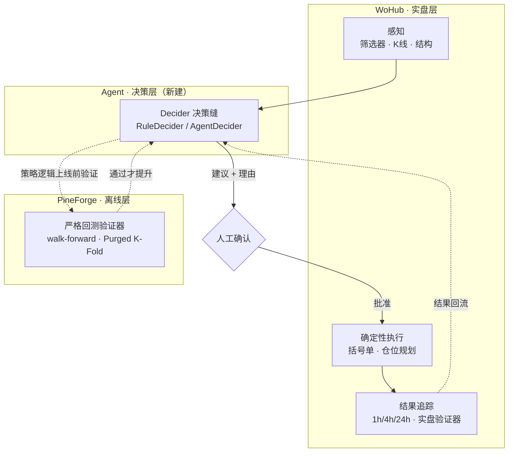

# WoHub Agent 化实施方案

> **⚠️ 已被取代（2026-07-02）：** 本文是与 Opus 的讨论稿。经对照代码逐条评估后，
> 修订版设计见 `docs/superpowers/specs/2026-07-02-agent-decision-layer-design.md`
> （主要修正：PineForge 不存在→验证器只留接口；运行时改 PydanticAI；决策 schema 对齐量化层 P4；
> 新增 tracker/信号数据地基加固为 Phase 0 必做项）。实现以修订版为准。

> 把现有交易信号平台 **WoHub** 升级为"带决策大脑"的策略 agent 系统。
> 本文综合了关于 agent 本质、框架生态、WoHub 代码评估、以及交易领域特殊性的全部讨论,给出推荐架构与分阶段落地路线。
> 适合直接放进 `docs/` 作为 plan/spec。

---

## 0. 核心结论(TL;DR)

几条定调的决策,论证见后文:

1. **WoHub 已经是"缺了大脑的 agent"。** 它已具备工具(筛选器 / K线 / 结构 / 交易所客户端 / 括号单 / 通知)、记忆(SQLite)、循环(调度器),唯一缺的是会做决策的 LLM 大脑。Agent 化 = **往这个系统里插一个大脑,不是从零搭**。
2. **Agent 待在"研究 / 决策支持"侧,绝不自动下单。** 真实下单这条循环在结构上就喂不出收敛式学习,且涉及真金白银的杠杆合约。决策由 agent 提,执行由现有确定性代码(`trading/service.py`)做,中间隔一道人工确认。
3. **用代码框架,不用 Dify / Coze。** 你有真实代码库、需要自定义验证器和对循环的精确控制——这是 LangGraph / PydanticAI 的地盘。推荐 **LangGraph**(与 PineForge 一致)。
4. **三件套架构:** WoHub(实盘感知 + 确定性执行 + 结果追踪)+ PineForge(离线回测验证器)+ 新 Agent(中间快速提假设)。
5. **验证器(verifier)设计是整个游戏的核心。** 交易里"回测好看 ≠ 实盘能用",agent 一晚上试一万次只会**更快地过拟合**。任何策略逻辑上线前必须过 PineForge 的严格验证。
6. **第一步是重构出"决策缝"**(`Decider` 接口)——这是上 agent 前唯一必须做的结构性改动。

---

## 1. 概念地基(为什么这么定)

### 1.1 Agent 的本质

一个 agent = **LLM(大脑)+ 工具(手)+ 循环(心跳)**。LLM 本身只会输出文本;它"调用工具"只是输出一段结构化文本,由你的代码执行后把结果塞回上下文,如此循环,直到它不再要工具、直接给出最终答案。

### 1.2 工作流 vs Agent

- **工作流(workflow):** 人把流程图**画死**,LLM 只负责填格子(分类、抽取、生成),"走哪条路"由你的设计决定。控制流固定。
- **Agent:** LLM 在运行时**自己决定**下一步、调哪个工具、何时停。控制流由模型动态决定。

WoHub 现在的 `executor.py`(跑筛选 → 跨分析 → 推送)是一个**写死的工作流**。Agent 化,就是把"决策"这一步从写死的规则,换成 LLM 动态决定——或者让两者并存、可切换、可对比。

---

## 2. WoHub 现状评估:你站在很高的起点

把 WoHub 摆到 agent 循环上,缺口一目了然:

| 循环环节 | WoHub 现状 |
|---|---|
| 感知 / 工具 | ✅ 已有:Pine 筛选器、K线获取、形态 / 结构(pivot/ATR)、背离分类、4 个交易所客户端、ChartShot 截图、Telegram/Discord 通知 |
| 执行 | ✅ 已有且架构正确:`trading/service.py` 的结构化仓位规划 + 括号单 + 止损恢复,全是确定性逻辑 |
| 记忆 | ✅ 已有:SQLite(signals / snapshots / outcomes / orders) |
| 循环 | ✅ 已有:APScheduler + `executor.py` |
| **决策大脑** | ❌ **缺**:当前决策 = 写死的筛选器配置 + `overlap_threshold` / `build_cross_analysis` |

三个值得点名的隐藏优势:

1. **`tracker.py` 的 1h/4h/24h 结果追踪 = 现成的"实盘验证器"。** 这是做决策评估和闭环改进的地基,多数人做 agent 做到一半才发现缺它。
2. **执行边界已经划对。** agent 只需决策,完全不必碰风险计算——`trading/` 层已经把确定性执行隔离好了。
3. **技术栈契合。** Python / FastAPI / Pydantic 是 LangGraph / PydanticAI 的原生土壤;你 API 路由里的 Pydantic 模型可直接复用为工具的 schema。

---

## 3. 统御原则:验证器视角(最重要的约束)

> 这一节决定了下面所有设计,务必内化。

**Coding 之所以最先跑出杀手级 agent(Claude Code),不是凑巧,而是因为它有一个又快、又便宜、又确定、又高保真的验证器:编译器 + 测试。** 那个人力循环里真正是引擎的,是"**测试 → 反馈 → 修正**"这一步——对错当场可判、可重复、几乎无歧义。

交易里其实有**两个**循环,必须分清:

- **策略开发循环**(≈ Claude Code 循环,= 你的 PineForge):想法 → 写成 Pine/Python → 回测 → 读结果 → 诊断 → 调整。生成那半,LLM 已经能干得很好。
- **实盘交易循环**(WoHub 侧):每个"测试"是一次真实交易——单次、要几小时几天才出结果、不可重复、烧真钱、单次结果几乎不含信息。

**致命差异:** coding 里"过测试 ≈ 对了";交易里 **"回测好看 ≠ 实盘能用"**。回测是一个**会泄漏、且你越优化它越骗你**的验证器(过拟合)。更危险的是 **机器速度下的多重检验**:人手调 10 个版本挑最好已经在 p-hack,agent 一晚上能试一万个,挑出来那个的高夏普几乎全是选择偏差堆出来的。

由此推出三条贯穿全案的硬约束:

1. **验证器设计就是整个游戏。** 你做的 walk-forward、Purged K-Fold with Embargo、triple-barrier(López de Prado 那套)本质上就是在给漏水的验证器堵漏。必须把"一共试了多少次"算进去(多重检验校正 / deflated Sharpe)。**绝不让 agent 去优化一个会泄漏的验证器。**
2. **瓶颈在验证,而 LLM 解决不了。** Coding 的瓶颈在生成(已被 LLM 解决);交易策略开发的瓶颈在验证,而瓶颈是市场本身——数据有限、有噪声、非平稳。Agent 只是让你**更快试假设**:既更快逼近真 edge,也更快骗到自己。
3. **实盘循环喂不出学习,所以 agent 不碰自动执行。** 这不只是安全考量,是结构使然。并且:优先选**广度大**的问题形式(横截面 / 一篮子资产 > 单资产择时),因为广度大 = 独立下注多 = 验证器没那么吵。

---

## 4. 目标架构:三件套

**职责划分:**

- **WoHub(实盘层):** 感知 + 确定性执行 + 结果追踪。`tracker.py` 提供实盘 ground truth。
- **PineForge(离线层):** 严格回测验证器。Agent 提出的任何**策略逻辑**,上线前先在这里过 walk-forward / Purged K-Fold / 多重检验校正。
- **Agent(决策层):** 坐在 WoHub 上,消费信号事件 → 用工具拉上下文(K线 / 结构 / 历史胜负)→ 推理 → 输出"建议 + 理由"到决策日志 → 推人工确认。**它在中间快速提假设,但既不拥有执行权,也不拥有最终验证权**(后者归 PineForge 和实盘)。

**关键概念——决策缝(Decision Seam):** 把 `executor.py` 里写死的决策步抽成一个 `Decider` 接口,现有规则做成 `RuleDecider`,新的做成 `AgentDecider`,两者可并存、可 A/B 对比。

---

## 5. 工具选型

**推荐:LangGraph。** 与 PineForge 一致(省心智切换成本),生产部署最主流,有 checkpoint / suspend-resume,天然支持人在回路。
**备选:PydanticAI。** 若你判断只需一个单 agent decider、不要复杂多 agent 分支,它更轻、强类型,跟你的 FastAPI/Pydantic 习惯契合。

**为什么不用 Dify / Coze:** 它们是给"不想写编排代码的人"的可视化 / 低代码平台,出 RAG 客服机器人、内部工具、快速原型最快。但你有真实代码库 + 大量领域逻辑(交易所客户端、结构分析、括号单)+ 需要自定义验证器和精确控制——套个可视化平台只会变成一层别扭的壳,天花板你很快会撞到。**它们解决的瓶颈你没有。**

**值得借鉴的一点:** 评估 / 可观测这块普遍欠建。Coze Loop(prompt 调试 + 质量评估 + 监控)或 Dify 的 LLMOps 的**理念**可以偷过来,用在你的 `decision_log` 复盘和 prompt 迭代上;但自包含系统里你自己埋点大概率就够。

---

## 6. 分阶段实施路线

> 每个阶段独立可交付、可回退。

### Phase 0 — 决策缝重构(必做的地基)
- 把 `executor.py` 的决策步抽成 `Decider` 接口(输入:筛选结果 + 上下文;输出:决策 + 理由)。
- 现有逻辑包成 `RuleDecider`,**零行为变化**。
- **交付:** 一个干净的接缝,后续 agent 平行接入。

### Phase 1 — 工具化(给大脑装手)
- 把 WoHub 核心能力包成 **MCP server**(你在 Claude Code 生态里,走 MCP 最顺):`get_klines`、`get_market_structure`、`run_screener`、`get_signal_outcomes`、`plan_position`,以及一个**带人工确认门**的 `place_bracket_order`。
- 工具的 **描述 + 报错信息** 要写给大脑看(质量一大半藏在这里)。
- **交付:** 任意 agent 都能把 WoHub 的能力当工具用。

### Phase 2 — Agent decider(插大脑)
- 用 LangGraph 建 `AgentDecider`,作为**独立异步 worker**。
- ⚠️ **关键:不要塞进同步的 cron 管线**——LLM 调用慢(每次几秒)又突发,会阻塞 1 req/2s 的调度器、拖死别的任务。
- 流程:消费一个筛选结果事件 → 调工具拉上下文 → 推理 → 写"决策 + 理由"。
- **交付:** agent 能对信号产出带理由的判断。

### Phase 3 — 审计与复盘(交易场景不可省)
- 新增 `agent_runs` / `decision_log` 表(prompt、工具调用、推理摘要、决策、关联 signal/outcome)。
- 前端加一个 Vue 复盘页(你前端现成),让你审阅 agent 的推理并打分。
- **交付:** 能回答"它当时凭什么这么判断"。

### Phase 4 — 闭环
- 把 `tracker.py` 的 1h/4h/24h 结果回流到决策日志,关联每条 agent 决策的事后胜负。
- 任何上升为"策略"的逻辑,先回 PineForge 做严格回测 + 多重检验校正再考虑提升。
- **交付:** agent 决策质量可量化、可追踪。

### Phase 5 — 受限自动执行(最后,且谨慎)
- 仅在大量纸面 / 影子运行、决策质量经统计验证之后才考虑。
- 硬约束:白名单、最大仓位、急停开关,且只能调用现有 `position_plan` / 括号单逻辑,**绝不让 agent 自己算风险**。
- **交付:** 在严格护栏内的部分自动化。

---

## 7. 硬约束 / 红线(任何阶段都不破)

- ❌ 不把 LLM agent 直接接到自动下单(尤其杠杆合约)。
- ✅ 决策 → 人工确认 → 确定性服务执行。
- ✅ 每个 agent 决策都有完整审计(prompt / 工具 / 理由 / 结果)。
- ✅ 任何策略逻辑上线前过 PineForge 严格验证 + 多重检验校正。
- ✅ Agent 推理 worker 与同步调度管线**解耦**(异步)。
- ✅ Agent 不碰风险计算,只复用现有 `position_plan`。

---

## 8. 待你决定的开放问题

- **Decider 粒度:** agent 是对"单个信号"判断,还是对"一次扫描的整批信号"做组合判断?
- **Agent 输出形态:** 纯文字建议推 Telegram,还是结构化决策对象写库 + 前端审阅?(建议后者,便于闭环量化)
- **PineForge ↔ WoHub 连接方式:** 共享数据契约?还是 PineForge 暴露一个"验证某策略"的服务供 agent 调用?
- **LangGraph vs PydanticAI 的最终取舍:** 取决于你要不要多 agent / 复杂分支,还是单一 decider 就够。
- **SQLite 是否够用:** 加了异步 agent worker 后并发写,是否需要迁 Postgres。

---

## 附:一句话总纲

> WoHub 已经有手、有记忆、有循环,你要做的是**插一个大脑,而且把这个大脑关在"研究 / 建议"的笼子里**;真正的胜负不在生成,而在验证——PineForge 是可信的验证器,实盘是最终裁判,agent 只是在中间帮你**更快、但更危险地**提假设。整个工程的纪律,就是不让这个更快的提假设能力,变成更快的自我欺骗。
